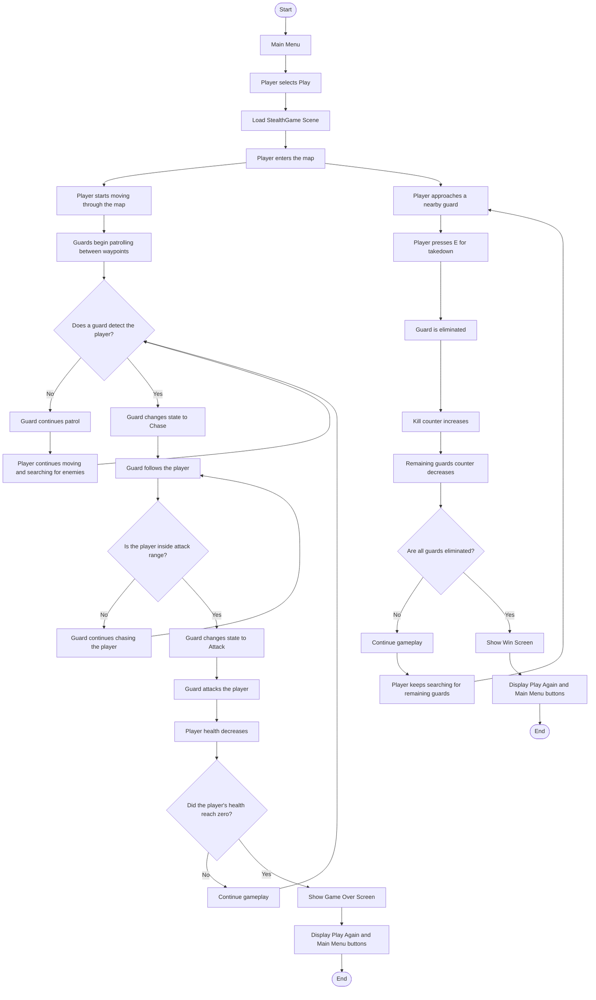

# Stealth Game

A 3D stealth action game developed in Unity, where the player must eliminate all guards in the map while surviving enemy attacks.

## Overview
This project is a stealth-action prototype built using Unity and C#.  
The player explores a guarded environment, avoids detection, eliminates enemies using takedown, and completes the mission by defeating all guards.

The game includes:
- Enemy AI with multiple states
- Player health system
- Kill and remaining counters
- Minimap
- Main Menu
- Win and Game Over screens

## Features
- Main Menu
- Player movement
- Player animation
- Enemy AI:
  - Patrol
  - Chase
  - Search
  - Attack
- Takedown mechanic
- Health bar
- Kill counter
- Remaining enemies counter
- Minimap
- Win screen
- Game Over screen
- Play Again / Main Menu buttons

## Controls
- **W, A, S, D** → Move
- **E** → Takedown nearby guard

## Objective
Eliminate all guards on the map to win.  
If the player's health reaches zero, the game ends with Game Over.

## Enemy AI System
The guards are controlled using a **Finite State Machine (FSM)**.

### States
- **Patrol**
- **Chase**
- **Search**
- **Attack**

### Detection Method
The guard detects the player using:
- Distance checking
- Vision angle checking
- Raycasting to verify line of sight

### Search Behavior
When a guard loses sight of the player:
- it stores the last known player position
- moves to that location
- searches nearby points
- then returns to patrol if the player is not found

## Agent Algorithm
The enemy AI is implemented using a **Finite State Machine (FSM)** with waypoint patrol, raycast-based vision, chase, search, and attack behaviors.

### Agent Inputs
- Distance to the player
- Vision angle
- Raycast line of sight
- Last known player position
- Attack range
- Attack cooldown

### Agent Logic
1. The guard starts in **Patrol** and moves between waypoint points.
2. If the player enters the guard’s field of view and is not blocked by obstacles, the guard detects the player.
3. If the player is detected and is far away, the guard enters **Chase**.
4. If the player is close enough, the guard enters **Attack**.
5. If the player is lost, the guard enters **Search** and moves to the last known player position.
6. If the player is not found after searching nearby points, the guard returns to **Patrol**.

## Game Flowchart



## Agent Pseudocode

```text
Initialize state = Patrol

Loop every frame:
    if guard is dead:
        stop behavior

    if player is visible:
        save last known player position

        if distance to player <= attack range:
            state = Attack
        else:
            state = Chase
    else:
        if current state is Chase or Attack:
            state = Search

    switch(state):
        Patrol:
            move between waypoints

        Chase:
            move toward player

        Attack:
            face player
            attack every cooldown period

        Search:
            move to last known player position
            check nearby search points
            if player not found:
                return to Patrol
```

## UI
- Main menu
- Health bar
- Kill counter
- Remaining guards counter
- Minimap
- Win panel
- Game Over panel

## Mission Brief
- **WASD** → Move
- **E** → Takedown guards
- Eliminate all guards to win
- Avoid enemy fire
- If your health reaches zero, you lose

## Tools and Technologies
- Unity
- C#
- TextMeshPro
- Unity UI

## Project Team
- Moustafa Soliman
- Nour Eladrosy